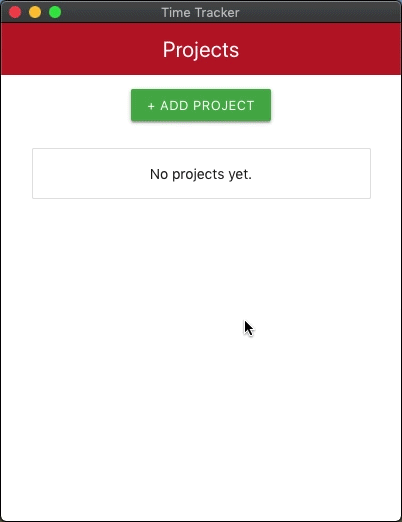

# TimeTracker

An intuitive way of tracking time spent on several tasks on different projects. A must-have tool for every freelancer. 

## Demo

## Features

* MacOS support
* Add, edit and remove projects
* Setting hourly rate per project
* Add, edit and remove tasks
* Time tracking
* Manual editing of time spent on each task
* Reporting tool with date sorting
* Desktop shortcuts
* Dark mode support (works with MacOS Mojave)
* Currency selector (found in the application menu)
* Native notifications (to notify when being idle for more than 10 minutes)

## Instructions

1. Download the app for MacOS from [here](https://github.com/1dv430/ab224qr-project/raw/master/release/TimeTracker-0.1.0.dmg).
2. Create your first project
3. Create your first task
4. Start the timer for your created task (▶)
5. Work!
6. Stop the timer when you are done (■)

## Shortcuts

* ⌘+A = View all projects
* ⌘+N = Create new project
* ⌘+⇧+R = View reports
* ⌘+H = Hide the application
* ⌘+Q = Quit the application

## License

The code is fully available under MIT license.

## Development

TimeTracker is built with React and Electron. Feel free to develop any additional features. To get started, simply do the following:

    git clone https://github.com/1dv430/ab224qr-project.git
    cd ab224qr-project
    npm install

Start React and Electron:

    npm run electron-dev

Build React:

    npm run build

Distribute Electron:

    npm run electron-pack

## Testing

To run tests, simply run the following command in your terminal:

    npm test
