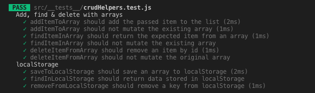
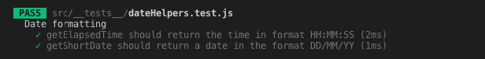
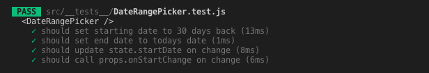
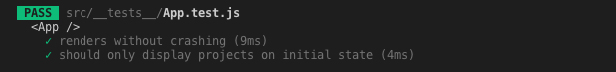
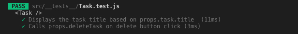
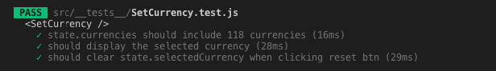
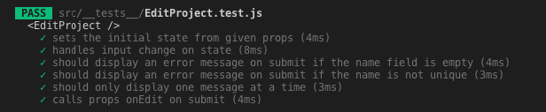

## Enhetstester utförda 2/6 2019

### Test suit 1. Crud Helpers

**Resultat**: Alla tester lyckades.

### Test suit 2. Date Helpers

**Resultat**: Alla testar lyckades.

### Test suit 3. Lägga till projekt

**Resultat**: Alla tester lyckades.

### Test suit 4. Lägga till uppgift

**Resultat**: Alla tester lyckades.

### Test suit 5. Datumintervallsväljare

**Resultat**: Alla tester lyckades.

### Test suit 6. Huvudkomponenten App

**Resultat**: Alla tester lyckades.

### Test suit 7. Task/Todo

**Resultat**: Alla tester lyckades.

### Test suit 8. Ange valuta

**Resultat**: Alla tester lyckades.

### Test suit 9. Redigera projekt

**Resultat**: Alla tester lyckades.

## Manuella tester utförda 2/6 2019

Vad testas | Hur testet sker | Förväntat | Kommentar
|-- |-- |-- |--
| Test suit M1. Skapa projekt | I desktop-appen | Projektet läggs till | Testet lyckades
| Test suit M2. Ta bort projekt | I desktop-appen | Projektet tas bort | Testet lyckades
| Test suit M3. Öppnas som desktop-app | På MacOS | Programmet öppnas framgångsrikt | Testet lyckades
| Test suit M4. Tidsräknaren räknar korrekt | I desktop-appen | Tidsräknaren har räknat till 10 | Testet lyckades
| Test suit M4.1. Räknad tid sparas | I desktop-appen | Räknad tid står kvar | Testet lyckades
| Test suit M5. Ange timpris på projekt | I desktop-appen | 500 presenteras till höger om projektets namn | Testet lyckades
 